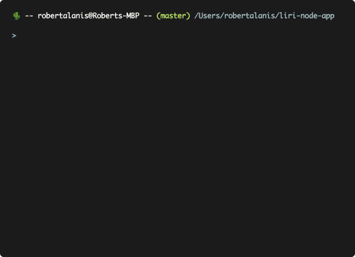

# LIRI-Bot

LIRI is like iPhone's SIRI. However, while SIRI is a Speech Interpretation and Recognition Interface, LIRI is a Language Interpretation and Recognition Interface. LIRI will be a command line node app that takes in parameters and gives you back data.

### Overview

LIRI will search Spotify for songs, Bands in Town for concerts, and OMDB for movies using the following commands:
   * `concert-this`
   * `spotify-this-song`
   * `movie-this`
   * `do-what-it-says`

### Example

##### Spotify Search

##### OMDB Movie Search

### Technologies Utilized

* NodeJS
* JavaScript
* Bands In Town API
* Spotify API
* OMDB API
* Axios
* CLI-Table3

### Deployment
1. Clone repo
1. Run npm install
1. At command prompt run node liri.js and pass in one of the four commands followed by a search.

